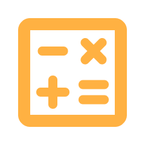
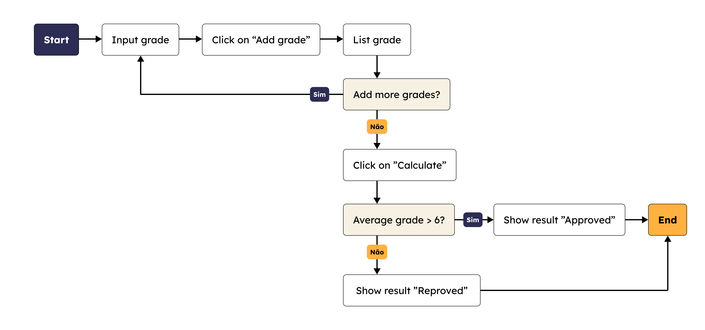
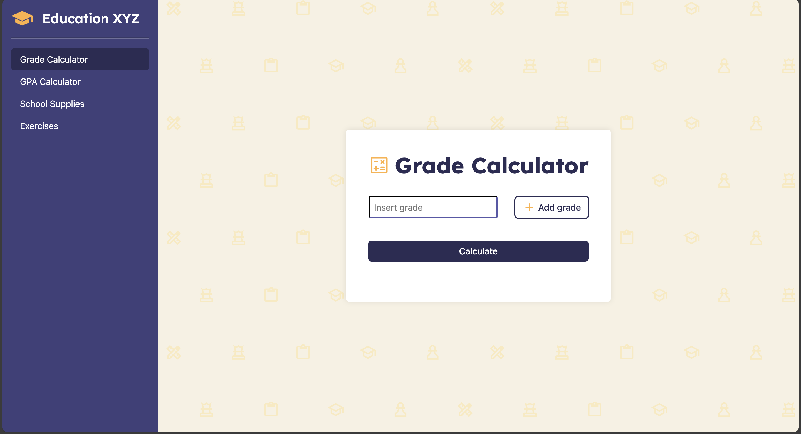
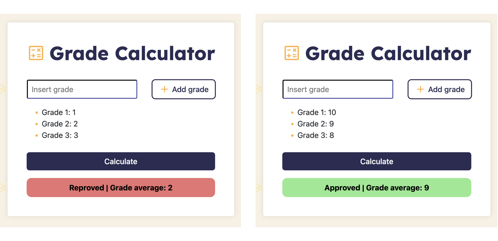

<h1>
    

        
        grade-calculator
    

</h1>

 

<h2>
    

        
        About
    

</h2>

This project is intended for learning and practicing the path, beggining to end, of a application usign HTML, CSS and JavaScript.

<h2>
    

        
        Algorithm flow
    

</h2>

<h2>
    

        
        Result
    

</h2>

<h2>
    

        
        References
    

</h2>

<a href="https://www.youtube.com/watch?v=3uQymob_L_A" style="color: #FFB142;"> 
    🔗 Lógica de Programação por TRYBE
</a>